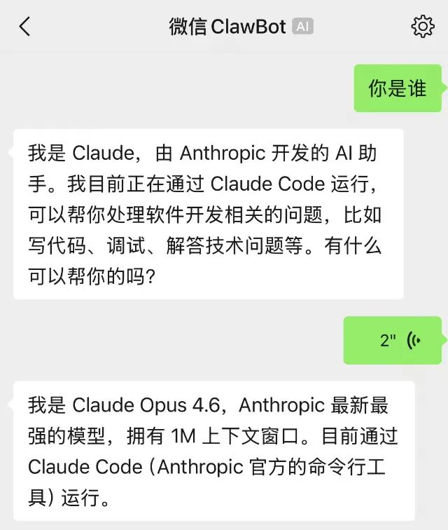
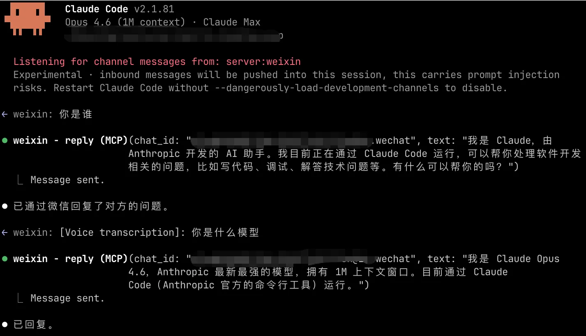

# cc-wei‍‌‌‌​​‌‌​‌​​‌​‌‌​‌​‌‌‌​​‌‌‌‌​‌​​​‌​‌‌‌‌‌‌‌​​‌‌​‌‌‌‌‌​​‌‌​‌​​‌‌​​​‌​‌​‌‌‌‌‌‌‌​​‌‌​‌​​‌‌‌​​‌​​​​​​​‌‌‌​​‌‌​‌​‌​​​‌‌‌​​‌​​‌​‌‌‌​​‌‌‌‌​​‌‌​‌​‌​​​​‌​​‌‌‌​‌‌‌‌‌​‌‌‌‌​​‌​​​​​​‌xin

> **C**ode **C**hannel — **W**ei**x**in（微信）

通过微信官方 iLink Bot API，将微信连接到 AI 编程工具。当前支持 Claude Code，后续计划支持 Codex 等更多平台。

<p align="center">
  
  
</p>

**👉 [新手图文教程：如何用微信连接 Claude Code](https://mp.weixin.qq.com/s/745V4wfyihsm6irqT0PABQ)**

## 特性

- **官方 API**：使用微信 iLink Bot API，非逆向工程
- **完整媒体支持**：收发图片、视频、语音消息和文件
- **访问控制**：配对码 + 白名单，防止未授权访问
- **本地安全**：MCP Server 通过 stdio 本地运行，无暴露端口
- **平台解耦**：微信通信层与平台适配层分离，便于扩展到更多 AI 编程工具

## 支持平台

| 平台 | 状态 |
|------|------|
| Claude Code | ✅ 已支持 |
| Codex (OpenAI) | 🔜 计划中 |

## 最新改进 (v0.2.4)

### 2026-04-13 更新：MCP 服务器保活机制优化

#### 问题描述
- **现象**: 每次执行 `auto-process.ts` 都显示检测到 2 个 server.ts 进程，导致反复终止和重启
- **影响**: 产生大量临时进程，server.ts 服务不稳定

#### 根因分析
- 原检测逻辑使用 `wmic process where "CommandLine LIKE '%server.ts%'"` 检测进程
- 由于 `auto-process.ts` 自身也是通过 `bun` 运行，命令行包含 `bun run auto-process.ts`，被误判为 server.ts 进程
- 导致检测逻辑始终认为有多个进程，触发清理和重启

#### 解决方案
1. **新增 `getServerProcessCount()` 函数**：精确检测 server.ts 进程数量
   - 检测条件：`name='bun.exe'` AND `CommandLine LIKE '%server.ts%'`
   - 排除 `auto-process.ts` 自身（避免误判）

2. **重构 `ensureMcpServer()` 函数**：确保有且只有一个 server.ts 进程
   - **0 个进程**：启动新的 server.ts
   - **1 个进程**：不执行任何操作（正常状态）
   - **多个进程**：保留最后一个，终止其他所有

3. **补充 `startMcpServer()` 函数**：后台启动 server.ts
   - 使用 `spawn('bun', ['server.ts'])` 直接启动
   - `stdio: 'ignore'` + `windowsHide: true` 确保完全后台运行

#### WMIC 检测命令
```bash
wmic process where "name='bun.exe' and CommandLine LIKE '%server.ts%'" get ProcessId,CommandLine
```

#### 效果
- ✅ 修复进程检测误判问题
- ✅ 确保只有 1 个 server.ts 进程运行
- ✅ 减少不必要的进程重启
- ✅ 添加详细日志，便于调试

#### 相关文件
- `auto-process.ts`：重构保活逻辑

---

### 2026-04-05 更新

#### 1. 权限自动确认机制 (P0)
- **问题**: Claude 执行中遇到权限限制需人工确认，微信端无法感知导致等待
- **解决**: 在 CLAUDE.md 中添加自动确认规则
- **配置**:
  - 文件创建/编辑：自动确认（工作空间内）
  - Bash 命令：自动确认（白名单内）
  - 子 Agent 创建：自动确认（最多 3 个并行）
  - 网络请求：自动确认（API 调用、知识库上传）
- **命令白名单**: git, npm, bun, node --eval, curl, mkdir, touch, cp, mv, rm, cat, echo

#### 2. 处理进度通知增强 (P2)
- **问题**: 长任务处理过程中用户无法感知进度
- **解决**: 每 2 分钟发送进度更新，每个 Phase 完成立即通知
- **格式**: `【处理中】Step X/Y - 描述`

#### 3. 自动记忆机制 (P2)
- **问题**: 手动记录容易遗漏
- **解决**: 处理完成后自动记录到 `memory/weixin-history.md`
- **格式**: 日期、消息摘要、处理流程、结果、标签

#### 4. Harness 并行控制
- **配置**: `/harness-work --parallel 3`
- **说明**: 最多 3 个子 Agent 并行，避免资源过载

## 最新改进 (v0.2.3)

### 1. MCP 服务器检测修复
- **问题**: `wmic` 命令返回 UTF-16 编码，Node.js 无法正确解析
- **解决**: 改用 `tasklist /FI "IMAGENAME eq bun.exe" /FO CSV` 命令
- **文件**: `auto-process.ts` (第30-50行)

### 2. 换行符处理修复
- **问题**: 命令行参数中的 `\n` 被原样发送，没有变成真正的换行
- **解决**: 添加 `.replace(/\\\\n/g, '\n')` 进行转换
- **文件**: `auto-process.ts` (第240行)

### 3. 多行消息自动检测
- **问题**: 长文本或多行内容显示混乱
- **解决**: 自动检测（>100字符或包含换行），自动使用 reply-file 方式
- **文件**: `auto-process.ts` (第238-254行)

### 4. 自动回复确认
- **新增**: 收到消息后自动回复"消息已收到，正在处理中..."
- **优化**: 让用户知道消息已被接收，提升体验

### 5. Harness 流程标准化
- **文档**: 在 CLAUDE.md 中添加完整 Harness 流程说明（Plan→Work→Review→Reply）
- **强制**: 每步结果必须返回给微信用户

## 最新改进 (v0.2.2)

### 1. 修复 getLastCheckTime 隐藏故障
- **问题**: `getLastCheckTime()` 在读取失败或时间戳无效时返回 0，导致所有历史消息被当作新消息处理
- **原因**: `return lastTimestamp || 0` 会将任何 falsy 值（包括 null、undefined）转为 0
- **修复**:
  - 增强类型检查：验证 `lastTimestamp` 是有效数字且大于 0
  - 添加错误日志：记录读取失败和无效时间戳情况
  - 安全回退：当 `lastCheckTime = 0` 时，自动使用队列最大时间戳作为基准

## 最新改进 (v0.2.1)

### 1. 消息处理机制优化
- **修复消息累积问题**: `savePendingMessages` 现在会过滤时间戳小于等于 `lastCheckTime` 的历史消息
- **修复时间戳更新逻辑**: 无新消息时使用队列最大时间戳更新，避免重复检查
- **添加 remove 命令**: 支持处理完单条消息后删除，`bun run auto-process.ts remove <timestamp>`

## 最新改进 (v0.2.0)

本次更新包含以下重要改进：

### 1. Harness 自动化集成 (NEW)
- **自动 Harness 处理**: 微信消息自动走 Harness 流程 (Plan → Work → Review → Reply)
- **新增 auto-harness.ts**: 消息去重和 Harness 队列管理
- **改进 auto-process.ts**: 默认行为自动调用 Harness，无需额外参数
- **使用方式**: `bun run auto-process.ts` 自动触发 Harness 处理

### 2. 智能消息处理架构
- **改进前**: 硬编码关键词匹配，只能处理固定命令
- **改进后**: Claude 智能理解自然语言，动态处理请求
- **优势**: 支持复杂多变的用户请求，无需预定义关键词

### 3. 消息发送功能修复
- ✅ 修复 IMAGE 类型消息发送（解决"已过期"问题）
- ✅ 修复 FILE 类型消息发送（解决文件接收问题）
- ✅ 优化 CDN 文件上传加密处理

### 4. 新增回复方式
- `reply-file` 命令：从文件发送多行格式化消息
- 保留原有 `reply` 命令用于简单回复

### 5. IMA 知识库集成
- 支持自动上传笔记到 IMA 知识库
- 一键生成文档并上传

详见 [改进文档](cc-weixin-improvement-doc.md)

## 前置要求

- [Bun](https://bun.sh) 运行时
- [Claude Code](https://claude.ai/code)（需支持 channel 功能）
- 微信账号
  - iOS：微信 8.0.70 或更高版本
  - Android：微信 8.0.69 或更高版本

## 安装

在 Claude Code 中添加市场并安装插件：

```
/plugin marketplace add qufei1993/cc-weixin
/plugin install weixin@cc-weixin
```

## 配置

### 1. 连接微信账号

```
/weixin:configure
```

用微信扫描终端中显示的二维码。

### 2. 启动 Claude Code 并启用微信 channel

```bash
claude --dangerously-load-development-channels plugin:weixin@cc-weixin
```

### 3. 配对微信用户

首次从微信发送消息时，会收到一个 6 位配对码。在 Claude Code 中确认：

```
/weixin:access pair 123456
```

## 使用

连接后，从微信发送的消息将出现在 Claude Code 中。Claude 的回复会发送回微信。

### Harness 自动化处理

启用 Harness 后，微信消息自动走完整处理流程：

1. **Plan**: 分析消息意图，制定处理计划
2. **Work**: 执行任务（搜索、计算、文件操作等）
3. **Review**: 多维度审查（安全、性能、质量）
4. **Reply**: 发送详细回复到微信

```bash
# 手动触发消息处理（自动调用 Harness）
cd ~/.claude/plugins/cache/cc-weixin/weixin/0.1.0
bun run auto-process.ts
```

## 消息处理机制

### 消息处理流水线

实际的消息处理流程如下：

```
[微信用户] → [MCP Server] → [queue.json]
                                    ↓
                            [auto-process.ts]
                                    ↓
                    ┌───────────────────────────────┐
                    │  1. 读取 last-check.json      │
                    │  2. 获取上次处理时间戳        │
                    │  3. 从 queue.json 读取消息    │
                    │  4. 筛选新消息                │
                    │     timestamp > lastTimestamp │
                    └───────────────────────────────┘
                                    ↓
                    ┌───────────────────────────────┐
                    │  savePendingMessages()        │
                    │  - 读取现有 pending.json      │
                    │  - 按 timestamp 去重          │
                    │  - 追加新消息（不删除旧消息） │
                    └───────────────────────────────┘
                                    ↓
                    ┌───────────────────────────────┐
                    │  Harness 处理流程             │
                    │  ├─ Plan: 分析意图           │
                    │  ├─ Work: 执行工具调用       │
                    │  ├─ Review: 审查结果         │
                    │  └─ Reply: 生成回复          │
                    └───────────────────────────────┘
                                    ↓
                            写入临时文件
                                    ↓
                    ┌───────────────────────────────┐
                    │  更新 last-check.json         │
                    │  max(timestamp)               │
                    └───────────────────────────────┘
                                    ↓
                            [auto-process.ts reply-file]
                                    ↓
                            [send.ts] → [微信用户]
                                    ↓
                            [remove 命令删除已处理消息]
```

**流程说明**：
1. **queue.json 不修改**：由 MCP Server 自然管理消息队列
2. **时间戳判断**：使用 `last-check.json` 记录上次处理的最大时间戳
3. **消息筛选**：只处理 `timestamp > lastTimestamp` 的新消息
4. **消息保存**：`savePendingMessages()` 使用追加模式，仅去重不删除
5. **Harness 处理**：消息走完整 Harness 流程（Plan → Work → Review → Reply）
6. **消息删除**：通过 `remove` 命令从 pending.json 删除已处理消息

## Memory 文档

项目相关的记忆和配置文档存放在 `memory/` 目录：

| 文件 | 说明 |
|------|------|
| [MEMORY.md](memory/MEMORY.md) | 记忆文档索引 |
| [harness-workflow-rule.md](memory/harness-workflow-rule.md) | Harness 流程处理准则（最高优先级） |
| [ima-usage-guide.md](memory/ima-usage-guide.md) | IMA 知识库使用指南 |
| [weixin-harness-workflow.md](memory/weixin-harness-workflow.md) | 微信消息 Harness 工作流配置 |

这些文档记录了项目的关键配置和使用规则，供 Claude Code 在不同会话间保持上下文一致。
                    │  └─ Reply: 生成回复          │
                    └───────────────────────────────┘
                                    ↓
                            写入临时文件
                                    ↓
                    ┌───────────────────────────────┐
                    │  更新 last-check.json         │
                    │  max(timestamp)               │
                    └───────────────────────────────┘
                                    ↓
                            [auto-process.ts reply-file]
                                    ↓
                            [send.ts] → [微信用户]
                                    ↓
                            [remove 命令删除已处理消息]
```

**流程说明**：
1. **queue.json 不修改**：由 MCP Server 自然管理消息队列
2. **时间戳判断**：使用 `last-check.json` 记录上次处理的最大时间戳
3. **消息筛选**：只处理 `timestamp > lastTimestamp` 的新消息
4. **消息保存**：`savePendingMessages()` 使用追加模式，仅去重不删除
5. **Harness 处理**：消息走完整 Harness 流程（Plan → Work → Review → Reply）
6. **消息删除**：通过 `remove` 命令从 pending.json 删除已处理消息

## 安全设计

- 使用微信官方 iLink Bot API
- 凭证文件 `chmod 0600` 保护
- 默认启用配对码访问控制
- 通过 stdio 本地运行，无网络端口暴露

## 许可证

MIT
